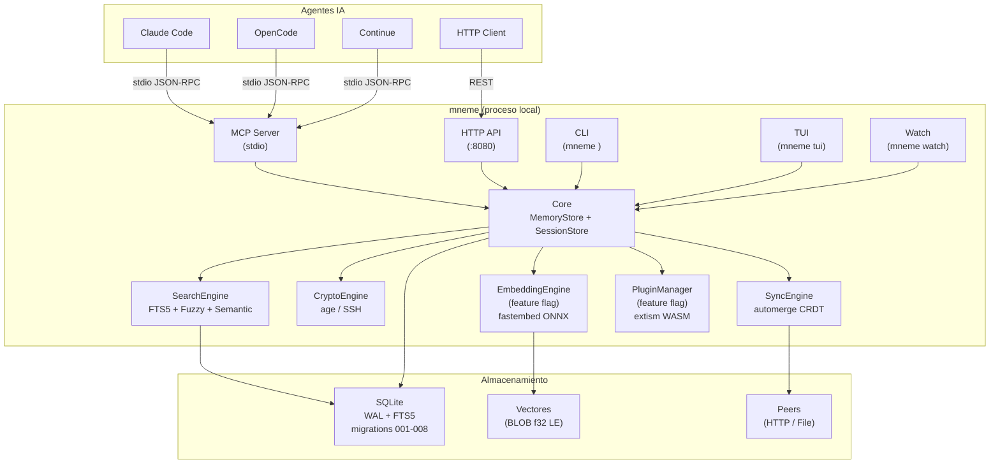
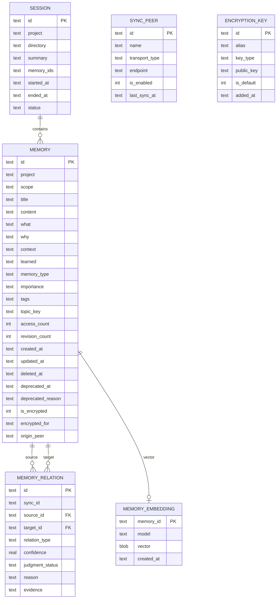
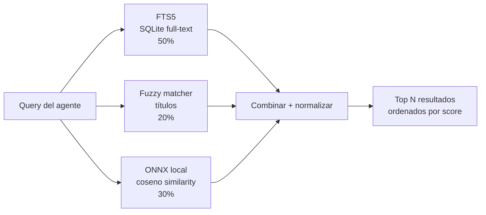
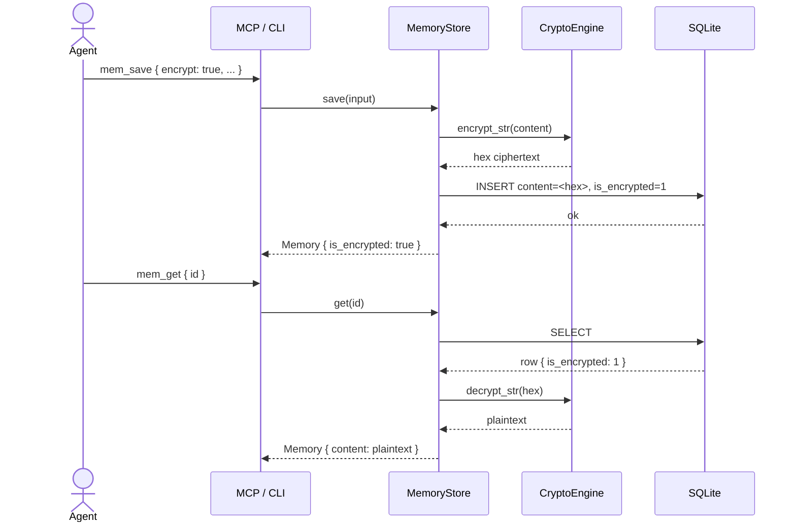
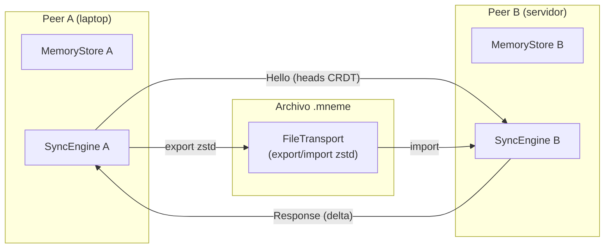

# mneme 🧠 — Persistent memory for AI coding agents

<div align="center">


[](https://crates.io/crates/mneme-brain)

**Persistent memory for AI coding agents** — hybrid search (FTS5 + fuzzy + ONNX), age/SSH encryption, CRDT P2P sync, interactive TUI with knowledge graph, WASM plugins, MCP server and HTTP API.

</div>

---

## Install

```bash
# crates.io
cargo install mneme-brain

# Homebrew
brew tap daddydiaz2/homebrew-tap
brew install mneme

# Docker
docker build -t mneme:latest https://github.com/daddydiaz2/mneme.git
```

---

## Tabla de Contenidos

- [Caracteristicas](#caracteristicas)
- [Arquitectura](#arquitectura)
- [Stack Tecnologico](#stack-tecnologico)
- [Modelo de Datos](#modelo-de-datos)
- [Busqueda Hibrida](#busqueda-hibrida)
- [Encriptacion](#encriptacion)
- [Sync CRDT](#sync-crdt)
- [Plugins WASM](#plugins-wasm)
- [Requisitos](#requisitos)
- [Instalacion](#instalacion)
- [Uso Rapido](#uso-rapido)
- [MCP Tools](#mcp-tools)
- [HTTP API](#http-api)
- [TUI](#tui)
- [Watch Mode](#watch-mode)
- [Estructura del Proyecto](#estructura-del-proyecto)
- [Roadmap](#roadmap)
- [Licencia](#licencia)

---

## Caracteristicas

### Almacenamiento y Busqueda
- **SQLite + FTS5** con WAL mode, búsqueda full-text sobre todos los campos
- **Búsqueda híbrida**: FTS5 (50%) + fuzzy matching (20%) + semántica ONNX (30%)
- **Soft delete** — nunca se pierde contexto, `deleted_at` en lugar de DELETE
- **Deduplicación automática** — hash normalizado con ventana de 24h, detección semántica de duplicados
- **Topic keys** — upserts evolutivos por `project + scope + topic_key`
- **Scopes**: `project` / `personal` / `global`

### Embeddings (feature opcional)
- **Motor ONNX local** con `fastembed` v4 — sin costos de API, 100% offline
- **Modelo**: BAAI/bge-small-en-v1.5 (384 dimensiones)
- **Reindexación** incremental con `mneme reindex`
- **Binario sin embeddings**: 13 MB · **Con embeddings**: 37 MB

### Introspección y Calidad
- `mem_audit` — memorias obsoletas, incompletas, deprecadas
- `mem_deduplicate` — detección de duplicados semánticos
- `mem_graph` — grafo de conocimiento con nodos y aristas tipadas
- `mem_inject_context` — bloque Markdown listo para inyectar en system prompts
- `mem_health` — estado del sistema, tamaño DB, embeddings no indexados
- `mem_remind` — recordatorios de memorias críticas no accedidas en >7 días
- `mem_knowledge_gaps` — áreas del proyecto sin cobertura de memorias

### Encriptacion
- **age v0.10** con soporte SSH — sin setup, usa `~/.ssh/id_ed25519` existente
- **Granular por memoria** — cada memoria decide si está encriptada; título y tags quedan en claro para búsqueda
- **Multi-recipient** — un ciphertext, múltiples destinatarios
- **FTS5 encryption-aware** — triggers que excluyen campos cifrados del índice
- Sync de ciphertext entre peers — seguro por diseño

### Sync CRDT P2P
- **automerge 0.5** — convergencia garantizada sin servidor central
- **Transportes**: HTTP (peer-to-peer) + File (export/import `.mneme`)
- **Compresión zstd** en tránsito
- Sync bidireccional: `pull` + `push`

### Plugins WASM
- **extism 1.30** — plugins sandboxeados en WebAssembly, pure-Rust
- **Feature flag** `plugins` — off by default, zero overhead sin el flag
- **ABI JSON**: `plugin_manifest` · `call_tool` · `transform_memory`
- **Hooks**: `pre_save` / `post_get` encadenados entre plugins
- **Discovery**: `~/.config/mneme/plugins/*.wasm` al startup

### Interfaz
- **MCP server** con 40 herramientas — compatible con Claude Code, OpenCode, Continue
- **HTTP API REST** — 30+ endpoints, compatible con cualquier cliente
- **CLI** — 25+ subcomandos
- **TUI ratatui** — lista + detalle + **grafo visual interactivo** de relaciones, búsqueda inline, indicadores `🔒`
- **Watch mode** — monitorea directorio, auto-guarda archivos `.mneme`

---

## Arquitectura



### Capas

```
+----------------------------------------------------------+
|  Interface Layer                                          |
|  MCP Server (stdio) · HTTP API · CLI · TUI · Watch       |
+----------------------------------------------------------+
|  Core Layer                                               |
|  MemoryStore · SessionStore · SearchEngine               |
+----------------------------------------------------------+
|  Feature Layers                                           |
|  CryptoEngine (age) · EmbeddingEngine (ONNX) · SyncEngine|
|  PluginManager (WASM / extism)                           |
+----------------------------------------------------------+
|  Storage Layer                                            |
|  SQLite WAL + FTS5 · Migraciones 001-008                 |
+----------------------------------------------------------+
```

---

## Stack Tecnologico

| Componente | Crate | Version | Uso |
|-----------|-------|---------|-----|
| **Runtime** | tokio | 1 | Async runtime |
| **Almacenamiento** | rusqlite | 0.32 | SQLite + FTS5 + WAL |
| **Migraciones** | rusqlite_migration | 1.2 | Migraciones SQL versionadas |
| **MCP** | rmcp | 0.1 | Protocolo MCP stdio |
| **HTTP** | axum | 0.7 | API REST |
| **CLI** | clap | 4 | Subcomandos + env vars |
| **TUI** | ratatui | 0.27 | Interfaz de terminal + Canvas grafo |
| **TUI eventos** | crossterm | 0.27 | Input + raw mode |
| **Serialización** | serde / serde_json | 1 | JSON |
| **Tipos** | uuid, chrono | 1 / 0.4 | IDs y timestamps |
| **Encriptación** | age | 0.10 | age + SSH recipient |
| **Embeddings** | fastembed | 4 | ONNX local (feature flag) |
| **Sync** | automerge | 0.5 | CRDT P2P |
| **Compresión** | zstd | 0.13 | Sync transport |
| **HTTP client** | reqwest | 0.12 | Sync HTTP transport |
| **Fuzzy** | fuzzy-matcher | 0.3 | Búsqueda aproximada |
| **Plugins** | extism | 1.30 | Runtime WASM sandboxeado (feature flag) |
| **Logging** | tracing | 0.1 | Structured logging |

---

## Modelo de Datos



### Tipos y Enums

| Enum | Valores |
|------|---------|
| **MemoryType** | `architecture`, `decision`, `bugfix`, `pattern`, `convention`, `dependency`, `workflow`, `note`, `config`, `discovery`, `learning` |
| **Importance** | `low`, `medium`, `high`, `critical` |
| **Scope** | `project`, `personal`, `global` |
| **RelationType** | `related`, `compatible`, `scoped`, `conflicts_with`, `supersedes`, `not_conflict`, `superseded_by` |

---

## Busqueda Hibrida

La búsqueda combina tres señales con pesos configurables:

```
Score final = FTS5 (50%) + Fuzzy (20%) + Semántica ONNX (30%)
```

Sin embeddings (sin feature o deshabilitados):

```
Score final = FTS5 (70%) + Fuzzy (30%)
```



---

## Encriptacion

### Flujo de encriptacion



### Setup de claves

```bash
# Registrar tu SSH key existente
mneme keys add laptop ~/.ssh/id_ed25519.pub --default

# Ver claves registradas
mneme keys list

# Verificar identidad
mneme keys test

# Detectar claves disponibles en el sistema
mneme keys detect
```

---

## Sync CRDT



### Comandos de sync

```bash
mneme sync status              # estado de peers y última sincronización
mneme sync add-peer <url>      # agregar peer HTTP
mneme sync now                 # sincronizar con todos los peers
mneme sync export --output sync.mneme   # exportar para transporte manual
mneme sync import sync.mneme           # importar desde archivo
```

---

## Plugins WASM

Los plugins extienden mneme sin recompilar — se descubren en `~/.config/mneme/plugins/*.wasm` al arrancar.

### Compilar con soporte de plugins

```bash
cargo build --release --features plugins
```

### ABI del plugin (3 funciones a exportar)

```
plugin_manifest()          → { name, version, tools: [...], hooks: [...] }
call_tool(json)            → { success, data, error }
transform_memory(json)     → { memory: {...} }
```

### Hooks disponibles

| Hook | Cuándo se invoca |
|------|-----------------|
| `pre_save` | Antes de persistir una memoria — puede transformar el contenido |
| `post_get` | Después de recuperar una memoria — puede enriquecer o filtrar |

Los hooks se encadenan: la salida del plugin N es la entrada del plugin N+1.

---

## Requisitos

- **Rust 1.75+** — `curl --proto '=https' --tlsv1.2 -sSf https://sh.rustup.rs | sh`
- **SQLite 3.35+** — incluido (rusqlite bundled)
- Para embeddings: **2 GB RAM** mínimo (modelo ONNX ~90 MB)

---

## Instalacion

### Con Docker

```bash
# Construir la imagen
docker build -t mneme:latest .

# Ejecutar el servidor HTTP (con persistencia en volumen local)
docker run -d \
  --name mneme \
  -p 8080:8080 \
  -v mneme-data:/app/data \
  -v $HOME/.config/mneme/plugins:/app/plugins \
  mneme:latest

# Usar el CLI directamente
docker run --rm -v mneme-data:/app/data mneme:latest mneme list --project mi-proyecto

# TUI (requiere terminal interactiva)
docker run --rm -it -v mneme-data:/app/data mneme:latest mneme tui
```

La imagen incluye todas las features habilitadas (embeddings ONNX + plugins WASM).

### crates.io (recomendado)

```bash
cargo install mneme-brain
```

Esto instala el binario `mneme`.

### Homebrew

```bash
brew tap daddydiaz2/homebrew-tap
brew install mneme
```

### Desde código fuente

```bash
git clone https://github.com/daddydiaz2/mneme.git
cd mneme

# Sin features opcionales (binario ~13 MB)
cargo build --release

# Con embeddings ONNX (binario ~37 MB)
cargo build --release --features embeddings

# Con plugins WASM
cargo build --release --features plugins

# Todo habilitado
cargo build --release --features embeddings,plugins

# Instalar globalmente
cargo install --path .
```

### Configuracion de agentes

| Agent | Comando |
|-------|---------|
| **Claude Code** | `mneme setup claude-code` |
| **OpenCode** | `mneme setup opencode` |
| **Cursor** | `mneme setup cursor` |
| **Windsurf** | `mneme setup windsurf` |
| **Continue** | `mneme setup continue` |
| **VS Code Copilot Chat** | `mneme setup vscode-copilot` |
| **Gemini CLI (Google)** | `mneme setup gemini-cli` |
| **Codex CLI (OpenAI)** | `mneme setup codex` |
| **Zed** | `mneme setup zed` |

Cada comando escribe la configuración MCP correspondiente en el directorio del agente.

---

## Uso Rapido

### CLI

```bash
# Guardar una memoria
mneme save --project mi-proyecto \
  --title "JWT auth middleware" \
  --type decision \
  --importance high \
  --tags rust,auth

# Buscar
mneme search "autenticación JWT" --project mi-proyecto

# Ver lista de memorias
mneme list --project mi-proyecto

# Auditar calidad
mneme audit --project mi-proyecto

# Iniciar TUI
mneme tui

# Watch mode (monitorea directorio)
mneme watch --project mi-proyecto --dir ./notas
```

### Como agente MCP

El servidor MCP se inicia con `mneme mcp` y se comunica por stdio. Los agentes lo configuran una sola vez y luego llaman las herramientas directamente.

```json
// Ejemplo: mem_save
{
  "tool": "mem_save",
  "params": {
    "project": "mi-app",
    "title": "Fixed N+1 en UserList",
    "content": "**What**: ...\\n**Why**: ...",
    "memory_type": "bugfix",
    "importance": "high",
    "tags": ["performance", "db"]
  }
}
```

---

## MCP Tools

40 herramientas disponibles, organizadas por categoría:

### CRUD Básico

| Tool | Descripción |
|------|-------------|
| `mem_save` | Guardar memoria (con deduplicación y topic key) |
| `mem_save_batch` | Guardar múltiples memorias en una llamada |
| `mem_save_prompt` | Guardar el prompt actual del agente |
| `mem_get` | Obtener memoria por ID |
| `mem_update` | Actualizar memoria existente |
| `mem_delete` | Soft-delete de memoria |
| `mem_restore` | Restaurar memoria eliminada |
| `mem_list` | Listar memorias del proyecto |

### Búsqueda

| Tool | Descripción |
|------|-------------|
| `mem_search` | Búsqueda híbrida (FTS5 + fuzzy + semántica) |
| `mem_similar` | Buscar memorias similares por embedding |
| `mem_timeline` | Memorias ordenadas por tiempo |
| `mem_context` | Contexto reciente de sesiones |

### Sesiones

| Tool | Descripción |
|------|-------------|
| `mem_session_start` | Iniciar sesión de trabajo |
| `mem_session_end` | Cerrar sesión |
| `mem_session_summary` | Guardar resumen de sesión |
| `mem_summarize` | Resumen ejecutivo de una sesión |

### Relaciones

| Tool | Descripción |
|------|-------------|
| `mem_conflicts` | Detectar conflictos entre memorias |
| `mem_delete_relation` | Eliminar relación por ID |
| `mem_graph` | Grafo de conocimiento del proyecto |

### Introspección y Calidad

| Tool | Descripción |
|------|-------------|
| `mem_audit` | Reporte de calidad (stale, incompletas, deprecadas) |
| `mem_deduplicate` | Detectar memorias duplicadas |
| `mem_feedback` | Registrar feedback useful / not_useful |
| `mem_deprecate` | Marcar memoria como obsoleta |
| `mem_health` | Estado del sistema |
| `mem_remind` | Recordatorios de memorias críticas no accedidas |
| `mem_tag_suggest` | Sugerir tags basado en vocabulario del proyecto |
| `mem_knowledge_gaps` | Detectar áreas sin cobertura |

### Contexto

| Tool | Descripción |
|------|-------------|
| `mem_inject_context` | Bloque Markdown listo para system prompt |
| `mem_forget_project` | Eliminar todas las memorias de un proyecto |

### Metadata

| Tool | Descripción |
|------|-------------|
| `mem_stats` | Estadísticas del proyecto |
| `mem_projects` | Listar proyectos |
| `mem_current_project` | Detectar proyecto actual (desde git) |
| `mem_doctor` | Diagnóstico del sistema |
| `mem_suggest_topic_key` | Sugerir topic key estable para upsert |

### Sincronización

| Tool | Descripción |
|------|-------------|
| `mem_sync_status` | Estado de peers y última sync |
| `mem_sync_now` | Sincronizar con todos los peers |
| `mem_sync_export` | Exportar para transporte manual |

### Encriptación

| Tool | Descripción |
|------|-------------|
| `mem_encrypt` | Encriptar memoria existente in-place |
| `mem_decrypt` | Desencriptar (retorna plaintext, no persiste) |
| `mem_keys_list` | Listar claves registradas |
| `mem_keys_status` | Estado de encriptación del sistema |

---

## HTTP API

El servidor HTTP se inicia con `mneme serve [--port 8080]`.

### Memorias

| Método | Ruta | Descripción |
|--------|------|-------------|
| `GET` | `/api/v1/memories` | Listar memorias |
| `POST` | `/api/v1/memories` | Crear memoria |
| `GET` | `/api/v1/memories/:id` | Obtener memoria |
| `PUT` | `/api/v1/memories/:id` | Actualizar memoria |
| `DELETE` | `/api/v1/memories/:id` | Eliminar (soft-delete) |
| `POST` | `/api/v1/memories/batch` | Crear múltiples |
| `POST` | `/api/v1/memories/:id/encrypt` | Encriptar in-place |
| `POST` | `/api/v1/memories/:id/decrypt` | Desencriptar (no persiste) |
| `POST` | `/api/v1/memories/:id/feedback` | Registrar feedback |
| `POST` | `/api/v1/memories/:id/deprecate` | Deprecar |

### Búsqueda e Introspección

| Método | Ruta | Descripción |
|--------|------|-------------|
| `GET` | `/api/v1/search?q=...&project=...` | Búsqueda híbrida |
| `GET` | `/api/v1/similar?id=...` | Similares por embedding |
| `GET` | `/api/v1/audit?project=...` | Reporte de calidad |
| `GET` | `/api/v1/duplicates?project=...` | Detectar duplicados |
| `GET` | `/api/v1/graph?project=...` | Grafo de conocimiento |
| `GET` | `/api/v1/context?project=...` | Contexto inyectable |
| `GET` | `/api/v1/health` | Estado del sistema |
| `GET` | `/api/v1/gaps?project=...` | Knowledge gaps |

### Claves y Sync

| Método | Ruta | Descripción |
|--------|------|-------------|
| `GET` | `/api/v1/keys` | Listar claves |
| `POST` | `/api/v1/keys` | Registrar clave |
| `DELETE` | `/api/v1/keys/:id` | Eliminar clave |
| `GET` | `/api/v1/keys/status` | Estado de encriptación |
| `GET` | `/api/v1/sync/status` | Estado de sync |
| `POST` | `/api/v1/sync/now` | Sincronizar |

---

## TUI

```
mneme tui
```

### Vista de lista + detalle

```
┌─────────────────────────────────────────────────────────────────────┐
│ mneme v0.5.0 │ proyecto: mi-app  │ [Q]uit [/]Search [Tab]Grafo [?]Help │
├────────────────────┬────────────────────────────────────────────────┤
│ MEMORIAS           │ DETALLE                                         │
│  🔒 ● [ARCH] ...  │ Título: JWT auth middleware                      │
│ >   ● [DEC]  ...  │ Tipo: decision   Importancia: high               │
│     ● [BUG]  ...  │ Proyecto: mi-app                                │
│     ● [PAT]  ...  │ Tags: [rust] [auth] [jwt]                       │
│  🔒 ● [NOTE] ...  │                                                 │
│                    │ ── Contenido ─────────────────────────────────  │
│                    │ **What**: Implementé JWT Bearer                 │
│                    │ **Why**: Auth stateless cross-instance          │
│                    │ **Where**: src/auth/middleware.rs               │
├────────────────────┴────────────────────────────────────────────────┤
│ [↑↓/jk] Navegar  [Tab] Grafo  [/] Buscar  [d] Eliminar  [Q] Salir  │
└─────────────────────────────────────────────────────────────────────┘
```

### Vista de grafo interactivo (`Tab`)

```
┌─────────────────────────────────────────────────────────────────────┐
│ mneme v0.5.0 │ proyecto: mi-app  │ [Q]uit [/]Search [Tab]Grafo [?]Help │
├─────────────────────────── GRAFO ───────────────────────────────────┤
│                                                                      │
│              [JWT middlewar]          ● CRDT sync                   │
│                    │                        │                        │
│              related ──────────────── supersedes                    │
│                    │                                                 │
│         ● bugfix N+1      ● arch-hexagonal                          │
│                    └────── conflicts_with ────┘                     │
│                                                                      │
├─────────────────────────────────────────────────────────────────────┤
│ [Tab/Esc] Volver  [j/k] Seleccionar nodo  [r] Recargar  [Q] Salir  │
└─────────────────────────────────────────────────────────────────────┘
```

**Controles lista**: `j`/`k`/`↑↓` navegar · `g`/`G` primero/último · `Tab` abrir grafo · `/` buscar inline · `r` refrescar · `d` delete con confirmación · `?` ayuda · `q` salir.

**Controles grafo**: `Tab`/`Esc` volver · `j`/`k` seleccionar nodo · `r` recargar relaciones.

**Indicadores**: `🔒` magenta = memoria encriptada · `●` rojo/amarillo/verde/gris = importancia (critical/high/medium/low) · `[TYPE]` tipo abreviado · nodo cyan = seleccionado · aristas verde/amarillo/gris = confidence ≥0.8 / ≥0.5 / <0.5.

---

## Watch Mode

Monitorea un directorio y auto-guarda archivos `.mneme` como memorias:

```bash
mneme watch --project mi-proyecto --dir ./notas --interval 2
# 👁  Watching ./notas for *.mneme files. Ctrl-C to stop.
# ✓ Guardado: JWT auth middleware
```

### Formato de archivo `.mneme`

Con frontmatter:
```
---
title: JWT auth middleware
type: decision
importance: high
tags: rust, auth, jwt
---
**What**: Implementé JWT Bearer tokens
**Why**: Auth stateless cross-instance
**Where**: src/auth/middleware.rs
```

Sin frontmatter (formato simple):
```
Título de la memoria
Contenido libre de la memoria...
```

---

## Memory Intelligence (Fase 1+2+3)

Capa de inteligencia sobre el almacenamiento crudo. mneme extrae entidades, detecta conflictos, comprime contexto, y mantiene ventanas de validez temporal.

### Extracción de Entidades

Detección automática de URLs, file paths, tecnologías, dependencias y conceptos CamelCase al guardar cada memoria.

- `mem_entity_extract(id|text)` — extrae entidades de una memoria o texto
- `mem_entity_search(query, entity_type?)` — busca memorias por entidad
- `mem_entity_links(id)` — memorias linkeadas por entidad compartida
- `mem_entity_frequent(project)` — entidades más frecuentes del proyecto

Las entidades también crean `entity_links` cross-memory cuando dos memorias mencionan la misma entidad, con `link_strength` basado en co-ocurrencia.

### Detección de Conflictos con LLM-Judge

Cuando se guarda una memoria que comparte `topic_key` o tiene título muy similar (fuzzy ≥80), se crea automáticamente un `relation_candidate` pendiente.

- `mem_judge(memory_id_a, memory_id_b, candidate_id, judged_relation, reasoning)` — el agente emite juicio
- `mem_compare(memory_id_a, memory_id_b)` — comparación estructurada para razonar
- `mem_conflict_candidates(project, status)` — lista candidatos pendientes

Si el juicio es `conflicts_with`, `supersedes`, o `extends`, se crea la relación real. Si es `supersedes`, la memoria anterior se depreca automáticamente.

### Passive Capture

`mem_capture_passive` parsea output de sesiones y extrae memorias automáticamente. Detecta secciones como `## Key Learnings`, `## Decisions`, `## Architecture`, etc.

```markdown
## Key Learnings
- Rust's async runtime works well with tokio
- Memory is stored as bytes in BLOB
```

→ Crea automáticamente memorias de tipo `learning` con `topic_key` apropiado.

### Búsqueda Multi-Señal con RRF

`mem_search` ahora corre 5 señales en paralelo y las fusiona con **Reciprocal Rank Fusion (RRF k=60)**:

1. **FTS5** full-text (BM25)
2. **Fuzzy** title matching
3. **Semantic** (cosine similarity)
4. **Entity** matching (boost memorias que comparten entidades con el query)
5. **Temporal** recency (preferir memorias accedidas recientemente)

Cross-encoder reranking opcional refina el top-N después de la búsqueda inicial con `search_reranked()`.

### Validez Temporal (ventanas bi-temporales)

Cada memoria puede tener una ventana de validez (`valid_from` / `valid_until`) y un JSON de provenance.

- `mem_temporal_query(query, at_time)` — "¿qué era verdad en fecha X?"
- Auto-invalidation: cuando se juzga un `supersedes`, la memoria anterior recibe `valid_until` automáticamente
- Provenance tracking: cada memoria puede tener un JSON array con `{agent, action, timestamp}`
- `valid_from`, `valid_until`, `provenance` aceptados también en `mem_save` como params opcionales

### Context Compression

4 estrategias para comprimir memorias antes de inyectarlas en prompts:

- `mem_compress(id, strategy)` — comprime 1 memoria
- `mem_compress_batch(project, strategy)` — comprime proyecto completo
- `mem_compress_context(project, strategy)` — genera bloque de contexto comprimido

Estrategias: `truncate`, `smart_summary` (1er párrafo + oraciones clave), `keywords_only`, `minimal` (solo tipo + título + keywords). Reversible — originales siempre disponibles vía `mem_get`.

### Multi-Provider Embeddings

Soporte para múltiples backends vía `MNEME_EMBEDDING_PROVIDER`:

| Provider | Configuración | Modelos |
|----------|---------------|---------|
| `onnx` (default) | `MNEME_EMBEDDINGS_MODEL` | bge-small/base/large-en-v1.5, all-MiniLM-L6-v2 |
| `openai` | `OPENAI_API_KEY` | text-embedding-3-small, ada-002, ollama/... via prefix |
| `ollama` | `OLLAMA_HOST` (default `http://localhost:11434`) | nomic-embed-text, mxbai-embed-large |
| `google` | `GOOGLE_API_KEY` | embedding-001, text-embedding-004 |

```bash
# OpenAI
MNEME_EMBEDDING_PROVIDER=openai OPENAI_API_KEY=sk-... mneme mcp

# Ollama local
MNEME_EMBEDDING_PROVIDER=ollama MNEME_EMBEDDINGS_MODEL=nomic-embed-text mneme mcp
```

### File Watcher Auto-Indexing

`mem_watch_scan(directory, ext, project)` escanea un directorio y auto-indexa archivos `.md` como memorias. Detecta cambios via content hash y re-indexa solo cuando el archivo cambió.

Formato esperado:

```markdown
---
title: My Memory
type: decision
importance: high
tags: [rust, auth]
what: We chose Rust for the auth service
why: Better async performance
---
Body content here
```

Frontmatter soporta: `title`, `type`, `importance`, `tags`, `what`, `why`, `context`, `learned`.

### Obsidian Vault Export

`mem_obsidian_export(project, output)` exporta el grafo de conocimiento a un vault de Obsidian:

```
mneme-export/
├── memories/
│   ├── My Memory.md          (frontmatter + structured fields + [[wikilinks]])
│   └── Other Memory.md
├── README.md                 (índice con memorias por tipo + más conectadas)
├── .graph/
│   └── graph.json            (graph data para visualización)
└── .obsidian/
    └── app.json              (metadata del vault)
```

Cada memoria incluye: YAML frontmatter (id, type, importance, tags, structured fields, temporal fields), `[[Wikilinks]]` a memorias relacionadas via `MemoryRelation`, y tags Obsidian inline.

### Cloud Sync Infrastructure

`mem_cloud_enroll(server, token, project)` inscribe el proyecto con un servidor cloud mneme.

```bash
# Levantar servidor cloud (Docker)
docker compose -f docker-compose.cloud.yml up -d

# Enroll local
mneme cloud enroll --server http://localhost:8080 --token $MNEME_CLOUD_TOKEN --project myproject
# O via MCP
mem_cloud_enroll(server="http://...", token="...", project="myproject")
```

- `mem_cloud_enroll` — inscribe el proyecto con un servidor
- `mem_cloud_sync` — ejecuta un ciclo de sync completo
- `mem_cloud_status` — estado y log de syncs recientes

Endpoints HTTP equivalentes: `POST /api/v1/cloud/enroll`, `POST /api/v1/cloud/sync`, `GET /api/v1/cloud/status`.

Docker compose incluido (`docker-compose.cloud.yml` + `Dockerfile.cloud`) para deployment self-hosted.

### Resumen de MCP Tools nuevos (Fases 1+2+3)

**Entity (4):** `mem_entity_extract`, `mem_entity_search`, `mem_entity_links`, `mem_entity_frequent`

**Conflict (3):** `mem_judge`, `mem_compare`, `mem_conflict_candidates`

**Capture (1):** `mem_capture_passive`

**Progressive (2):** `mem_expand` (Layer 2), `mem_transcript` (Layer 3)

**Temporal (1):** `mem_temporal_query`

**Compression (3):** `mem_compress`, `mem_compress_batch`, `mem_compress_context`

**Watcher (1):** `mem_watch_scan`

**Export (1):** `mem_obsidian_export`

**Cloud (3):** `mem_cloud_enroll`, `mem_cloud_sync`, `mem_cloud_status`

Total: **24 nuevos MCP tools** (40 → 64).

### Tests añadidos

```
tests/entities_tests.rs        17 tests
tests/compress_tests.rs        15 tests
tests/obsidian_tests.rs         9 tests
tests/cloud_tests.rs            9 tests
tests/rerank_tests.rs           9 tests
tests/watcher_new_tests.rs     12 tests
────────────────────────────────────────
Total nuevos:                  71 tests
```

Total suite de tests: **148 tests pasando** (1 sync timeout preexistente de automerge).


## Estructura del Proyecto

```
mneme/
├── assets/
│   └── imagen.png                 # Banner y recursos visuales del README
├── src/
│   ├── main.rs                    # Entry point: init chain → dispatch
│   ├── lib.rs                     # Re-exports de módulos públicos
│   ├── error.rs                   # MnemeError (26+ variantes)
│   ├── cli/
│   │   ├── commands.rs            # 25+ subcomandos Clap
│   │   └── output.rs              # Pretty-print con colores
│   ├── config/
│   │   └── settings.rs            # Settings: DB, Server, MCP, Crypto, Sync, Embeddings
│   ├── store/
│   │   ├── db.rs                  # Database: open, WAL, PRAGMAs, stores
│   │   ├── memory.rs              # MemoryStore, SessionStore, tipos, GraphData
│   │   ├── search.rs              # SearchEngine híbrido + SearchWeights
│   │   └── migrations.rs          # Registro de migraciones 001-008
│   ├── mcp/
│   │   ├── server.rs              # MnemeServer (stdio JSON-RPC) + PluginManager
│   │   └── tools.rs               # 40 handlers MCP + dispatch dinámico de plugins
│   ├── http/
│   │   ├── router.rs              # create_router (axum)
│   │   └── handlers.rs            # 30+ handlers HTTP
│   ├── embeddings/                # Feature flag: --features embeddings
│   │   ├── mod.rs                 # Re-exports + stubs
│   │   ├── engine.rs              # EmbeddingEngine (fastembed ONNX)
│   │   ├── store.rs               # EmbeddingStore (BLOB f32 LE)
│   │   └── similarity.rs          # cosine_similarity, SemanticMatch
│   ├── crypto/
│   │   ├── engine.rs              # CryptoEngine (age encrypt/decrypt)
│   │   ├── keys.rs                # RecipientKey, IdentityKey (SSH/age)
│   │   └── store.rs               # KeyStore (SQLite)
│   ├── sync/
│   │   ├── protocol.rs            # SyncMessage, HelloMsg, ResponseMsg
│   │   ├── crdt.rs                # memory_to_doc, merge_docs (automerge)
│   │   ├── peer.rs                # Peer, PeerStore, TransportType
│   │   ├── engine.rs              # SyncEngine: build_hello, apply_response
│   │   └── transport/
│   │       ├── http.rs            # HttpTransport (reqwest)
│   │       └── file.rs            # FileTransport (zstd export/import)
│   ├── plugins/                   # Feature flag: --features plugins
│   │   ├── manifest.rs            # PluginManifest, PluginTool
│   │   ├── manager.rs             # PluginManager: discovery, load, dispatch, hooks
│   │   └── mod.rs                 # Re-exports
│   ├── tui/
│   │   ├── app.rs                 # App: estado, modos (Normal/Graph/Search/Help/Confirm)
│   │   ├── events.rs              # Manejo de teclas por AppMode
│   │   ├── graph.rs               # layout_nodes() circular, truncate_title()
│   │   └── ui.rs                  # Render: lista, detalle, grafo Canvas, overlays
│   ├── export/
│   │   └── markdown.rs            # export_to_markdown, import_from_markdown
│   └── watch/
│       └── watcher.rs             # DirectoryWatcher: polling + parse .mneme
├── migrations/
│   ├── 001_initial.sql            # Tablas base: memories, relations, sessions
│   ├── 002_fts5.sql               # Índice FTS5 full-text
│   ├── 003_vectors.sql            # Tabla embeddings (BLOB)
│   ├── 004_tools.sql              # Columnas feedback, deprecated, supersedes
│   ├── 005_sync.sql               # Tablas sync: state, peers, log
│   ├── 006_sync_origin.sql        # Columna origin_peer
│   ├── 007_encryption.sql         # Columnas is_encrypted, encrypted_for; encryption_keys
│   └── 008_fts5_encryption_aware.sql  # Triggers FTS5 encryption-aware
├── tests/
│   ├── store_tests.rs
│   ├── mcp_tests.rs
│   ├── integration_tests.rs
│   ├── embeddings_tests.rs
│   ├── sync_tests.rs
│   ├── crypto_tests.rs
│   ├── store_extended_tests.rs
│   ├── config_tests.rs
│   ├── search_tests.rs
│   ├── export_tests.rs
│   ├── plugin_tests.rs
│   └── tui_graph_tests.rs
├── Cargo.toml
├── Cargo.lock
├── Dockerfile
├── .dockerignore
├── README.md
├── docs/
│   └── api.http                   # Ejemplos interactivos de API REST
└── assets/
    └── imagen.png                 # Banner y recursos visuales
```

---

## Roadmap

### Implementado

- [x] Store SQLite + FTS5 + WAL
- [x] Soft delete, deduplicación automática, topic keys
- [x] Scopes: project / personal / global
- [x] MCP server con 40 herramientas
- [x] HTTP API REST (30+ endpoints)
- [x] CLI con 25+ subcomandos
- [x] Embeddings ONNX local (BAAI/bge-small-en-v1.5) como feature flag
- [x] Búsqueda híbrida: FTS5 + fuzzy + semántica
- [x] Introspección: audit, deduplicate, graph, health, remind, gaps
- [x] Encriptación granular con age / SSH keys
- [x] Sync CRDT P2P con automerge (HTTP + file transport)
- [x] TUI interactiva con ratatui
- [x] Grafo visual interactivo en TUI (Canvas, layout circular, `Tab`)
- [x] Watch mode (monitoreo de directorio)
- [x] Export/import Markdown
- [x] Feature flag `embeddings` — binario base 13 MB
- [x] Plugins WASM con extism (feature flag `plugins`)
- [x] Setup automático para Claude Code, OpenCode, Continue
- [x] Docker image oficial con todas las features
- [x] Documentación de API con ejemplos interactivos
- [x] **Entity extraction** (URLs, file paths, tecnologías, conceptos) con auto-linking cross-memory
- [x] **LLM-judge conflict detection** con auto-invalidation de memorias supersedidas
- [x] **Passive capture** desde output de sesiones (Key Learnings, Decisions, Architecture)
- [x] **Multi-signal RRF search** (5 señales: FTS5, fuzzy, semantic, entity, recency)
- [x] **Progressive 3-layer retrieval** (search → expand → transcript)
- [x] **Cross-encoder reranking** opcional
- [x] **Temporal validity windows** (`valid_from`, `valid_until`, `provenance`)
- [x] **Context compression** (4 estrategias: truncate, smart_summary, keywords_only, minimal)
- [x] **AgentFact memory type** + provenance tracking
- [x] **Multi-provider embeddings** (ONNX, OpenAI, Ollama, Google)
- [x] **File watcher** con auto-indexing de .md y content hash detection
- [x] **Obsidian vault export** con frontmatter, wikilinks, y graph data
- [x] **Cloud sync** con enrollment, autosync background, y docker compose self-hosted
- [x] **Cloud HTTP endpoints** (`/api/v1/cloud/{enroll,sync,status}`)
- [x] **Cloud MCP tools** (`mem_cloud_enroll`, `mem_cloud_sync`, `mem_cloud_status`)

### Planificado

- [x] Cobertura de tests: **302 tests**, 21 suites, Clippy 0 warnings (de ~107 → 302, +182%)

---

## Contribuir

1. Fork → rama desde `dev`
2. Commits en [Conventional Commits](https://www.conventionalcommits.org/): `feat:`, `fix:`, `chore:`, etc.
3. Push a `dev` → Pull Request a `dev` → merge a `main`

### Convenciones

- Código e identificadores en inglés; comentarios en español (neutral)
- Sin `unwrap()`/`expect()` en producción — usar `?` o `map_err`
- `tracing` para logs, nunca `println!`
- `cargo clippy -- -D warnings` debe pasar antes de cualquier PR
- `cargo fmt` aplicado

---

## Donaciones

¿Te gusta mneme? Invitame un café ☕

[](https://www.paypal.com/donate/?hosted_button_id=VDP69Z8GNTAR2)

## Licencia

**MIT** — ver [LICENSE](LICENSE).

---

<div align="center">

Desarrollado en Rust 2021 · SQLite · automerge · age · ratatui · extism

**mneme** — Memoria que persiste, conocimiento que evoluciona.

</div>
